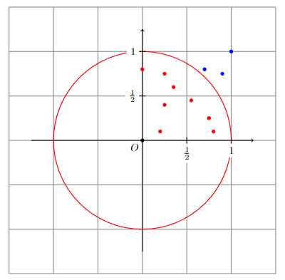
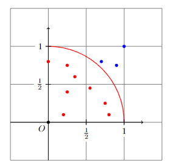
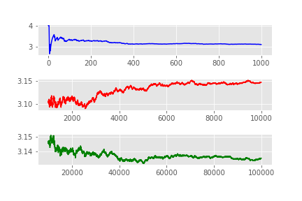
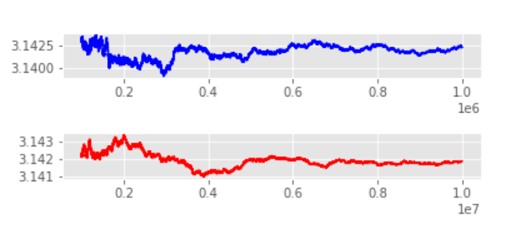

# Pi Approximation

This is a program in Python capable of estimating the number $\pi$ with $0.05\%$ accuracy through an analysis of randomly chosen points in a plane containing a circumference, as shown in the following image.

 

 
 

 

The points are randomly generated uniformly between $[0,1]$, so the points can be inside or outside the circumference. Note that when the total number of points tends to infinity, the ratio between the points inside the circumference and the total number represents, with some fidelity, the ratio between the areas of the structures, that is,
$$
    \dfrac{pts_{inside}}{pts_{total}} = \dfrac{area_{\bigcirc}}{area_{\square}} \\
$$

The circle used has a center at $(0,0)$ and a radius $r = 1$, such that its internal points can be described by the inequality:
$$
    x^2 + y^2 \leq 1
$$

It is well known that the area of a circle is given by $\pi r^2$. Given that the diameter of the circle is equal to the side of the square, we can state the following relationship.

$$
    \dfrac{pts_{inside}}{pts_{total}} = \dfrac{\pi r^2}{(2r)^2} 
$$

Adopt the ratio $\dfrac{pts_{inside}}{pts_{total}}$ as $\kappa$. The number $\pi$ can be estimated by $\pi = 4 \kappa$. 

## Development

For the purpose of simplifying calculations and program understanding, only $25\%$ of the circumference was used, so that the space covers only the first quadrant, as shown in the image below.

 

 
 

 

## Simulation
The ratio $\kappa$ was observed in several simulations, and the average cases are as follows:

 

 
 

 

 
<em>Mid-case obtained by the ratio with total points ranging from 0 to 1e-5.</em> 

 

As observed, the first thousand points do not provide a good estimate since $\kappa$ varies between $[0,4]$. When the total points are in the range $[10^3, \ 10^4]$, the estimate becomes more accurate, as expected. However, it can be seen that between ten thousand and one hundred thousand points, despite the sample increasing significantly, the accuracy of $\kappa$ does not grow significantly.

 

 
 

 

 
<em>Mid-case obtained by the ratio with total points ranging from 1e-5 to 1e-7.</em> 

 

It is only with a sample of $10^6$ total points that the second decimal place is found. From $10^8$ points onwards, it is expected that the third decimal place will be discovered. However, computational time exceeds the acceptable limit, so we will work with ten million points on average. Also, to avoid overload, the $\kappa$ ratio will be calculated only after $10^7$ generated points.

## Approximation
To achieve an accuracy of $0.05\%$, the allowed margin of error is only $0.0015$, approximately. Due to the inability to increase the sample size, an additional resource was used: the calculation of the standard deviation. It is known that the standard deviation can be calculated by the expression

$$
    s = \sqrt{\frac{1}{N-1} \sum_{i=1}^N (x_i - \overline{x})^2}.
$$

This calculation was done using the *numpy* library, which already has some ready-made mathematical operations. The value of the standard deviation will be used to check the third decimal place, which has not yet been found. Defined as $s \leq 0.0005$, the program looks for a sample of 5000 $\kappa$ values that satisfy this condition.

As observed in the section above, a sample of $1000$ terms can be highly erratic. Therefore, if a slightly larger sample of $5000$ terms has a standard deviation less than or equal to $s$, then it is likely to be a good estimate. Through simulations, it was observed that these parameters meet the initial conditions in $98\%$ of cases, on average.

## Conclusion
The main challenge of the exercise was to establish a viable relationship between precision and execution time. Given the constraints of the problem, a large number of points is required for the estimate to be truly accurate. Furthermore, the $\kappa$ ratio develops chaotically, making it difficult to model or predict its behavior. However, the chosen approach by the student achieves up to the second decimal place with mastery, with a small percentage of error for the third.
